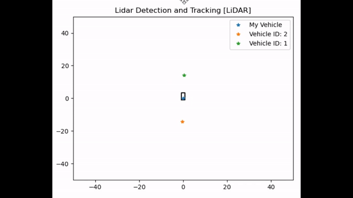
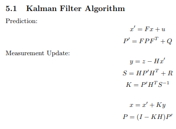
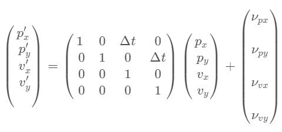
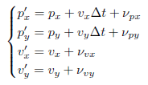
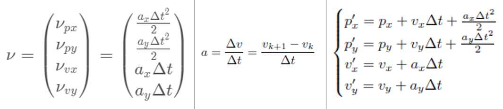
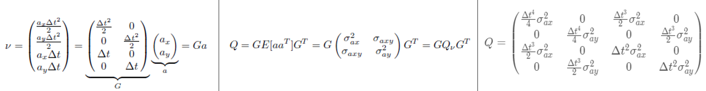
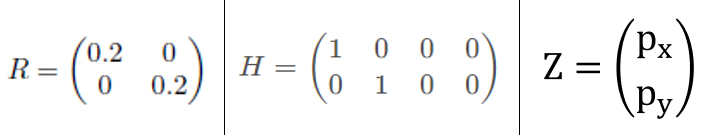
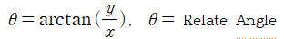
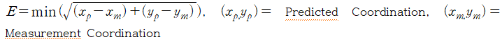
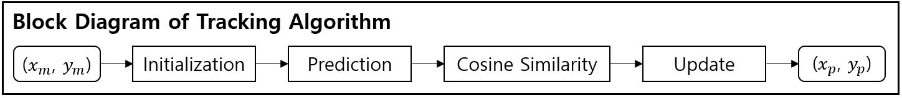

# Extended Kalman Filter for Tracking Surrounding Vehicles

---
---

## Overview

---

이는 자율 주행 차량에 장착된 Lidar나 Camera, Radar 센서 등 주위 객체를 Detection하는 센서를 위한 Tracking 알고리즘으로, 다중으로 Detection된 객체 중 찾고자 하는 객체를 탐지하여 해당하는 객체의 위치 변화를 추적하는 방법이다.

대표적으로 SORT(Simple Online Real-time Tracking)과 Deep SORT 알고리즘을 주로 사용하며, 두 알고리즘은 서로의 장단점을 가지고 있다. 먼저 SORT 알고리즘은 Kalman Filter와 Hungarian 알고리즘으로 이루어져 있다[1]. 이는 Deep SORT보다 정확도가 상대적으로 낮다는 단점이 있지만, 연산 속도 측면에서 빠른 장점이 있다. 다음 Deep SORT 알고리즘은 기존 SORT 알고리즘에 딥러닝을 적용한 것으로, 연산 속도가 상대적으로 낮은 단점이 있지만, 정확도 측면에서 우수한 성능을 나타낸다[2].

이 코드는 위에 설명한 SORT 알고리즘을 사용한 Multi Object Tracking 알고리즘이다. SORT 알고리즘을 사용한 이유는 대표적으로 차량에 장착된 PC의 메모리 사용량을 최적화하기 위함이다. 실제 Lidar나 Camera 등의 인지 부분을 담당하는 센서를 처리하기 위해, 차량에 PC를 장착하여야 한다. 인지 센서를 처리하는 PC는 센서의 사양에 적합한 제원으로 이루어져야 하며, 딥러닝 등의 다양한 알고리즘을 처리하기 위해서는 보다 높은 PC의 사양이 요구된다. 하지만 저사양 PC가 장착되어 있거나, 적합한 제원의 PC이지만 다량의 연산이 필요한 경우, 메모리 과부하로 인해 센서를 사용할 수 없게 된다. 이러한 이유로 하나의 PC에서 인지 센서의 Detection과 Tracking을 융합하여 진행하기 위해, 연산량이 적은 SORT 알고리즘을 바탕으로 코드를 작성하였다.

SORT 알고리즘은 기본적으로 Prediction과 Matching으로 이루어져 있다. Prediction을 담당하는 KF(Kalman Filter)는 주로 EKF(Extended Kalman Filter)나 UKF(Unscented Kalman Filter)를 사용한다. 이 또한 장단점이 있으며, 알고리즘을 사용하는 환경에 맞춰 선택되어 사용된다. 먼저 EKF는 비선형 함수를 미분하여 선형으로 근사화한 뒤, KF를 적용하는 방식이다. 이는 비선형 모델에서 UKF 보다 정확도가 근소하게 낮은 단점이 있지만, 속도 측면에서 높다는 장점이 있다. 또한 UKF는 Parameter를 지정하여 비선형 함수 자체를 추정한 뒤, KF를 적용하는 방식이다. 이는 EKF보다 계산속도가 근소하게 낮은 단점이 있지만, 정확도 측면에서 높다는 장점이 있다. 본 SORT 알고리즘에서는 위의 메모리 문제점을 최소화하기 위하여 EKF을 사용하였다.

다음으로 Matching을 위해 사용되는 Hungarian 알고리즘은 연산량을 최소화하는 최적의 Matching 알고리즘이다[3]. IoU 방법을 사용하기 때문에 쉽게 구현되며 Matching 알고리즘에 대표적으로 사용되고 있다. IoU Matching에 필요한 데이터는 인지된 객체의 각 Edge Point나 중심점을 비롯한 Width, Length이다. 하지만 빛의 산란이나 야간에서의 Camera, 악천후나 채널 수가 적은 Lidar 환경에서 Detection을 진행할 경우, 원하지 않는 Bounding Box가 생성되는 경우가 있다. 그러므로 SORT 알고리즘을 활용하는 과정에서 위와 같은 악조건에 대응하기 위해, Detection되어 수신되는 객체의 좌표만을 사용하여 Matching한다. 기존에 사용되는 Hungarian 알고리즘을 대체하여 코드에서는 Cosine 유사도와 Euclidean 거리 검출법을 사용하여 Matching 하였다.

## Prediction

---

### EKF을 설명하기에 앞서 KF를 설명한다.

KF는 잡음이 포함된 측정치(좌표)를 바탕으로 다음의 좌표를 Prediction하는 과정으로 이루어져 있다[4]. Prediction과 Update를 반복하는 알고리즘으로 이루어져 있으며, Prediction 단계에서는 현재 상태 변수의 값과 정확도를 예측하고, Update 단계에서는 이전에 추정한 상태 변수를 기반으로 예측한 측정치와 실제 측정치의 차이를 반영해 현재의 상태 변수를 업데이트한다. 기존 KF는 선형 시스템 기반으로 이루어져 있으며 수식으로는 다음과 같다.

x는 State Vector을 나타내며, F는 이전 상태에 기반한 상태 전이 행렬이다. 또한 u는 사용자의 입력값이며, P는 State Covariance(연산 과정에 의한 오차 공분산 행렬), Z는 잡음이 추가된 실제 측정 데이터 행렬, Q는 시스템 잡음을 추가한 공분산 행렬, R은 상수 값으로 잡음이 추가된 측정 데이터(Z)의 공분산 행렬이다. Q와 R은 보통 사용자가 설정하는 값으로, 대체로 센서 제조사가 제공한다. H는 예측된 값을 도출하는 행렬이고, y는 실제 측정치와 예측된 측정치 차이에서 나오는 Residual 값이며, S는 y의 공분산 행렬, K는 Kalman Gain을 뜻한다.
즉, 위의 설명과 수식을 기반으로 설명하자면, 초기의 x, P값은 초기 Prediction이 필요하기에 Update 과정이 없이 Prediction을 시작한다. 이후 두 번째로 들어오는 측정값에 대하여 Prediction과 Update를 진행하는데, Prediction에서는 이전에 Prediction된 x와 상태 전이 행렬 F, 사용자의 입력값 u을 바탕으로 다음의 x를 Prediction한다. 마찬가지로 P는 상태 전이행렬 F, Transpose F과 이전에 Prediction된 P와 사용자가 지정한 Q로 다음의 P를 Prediction한다. 그 다음으로 Update 단계로 넘어가는데, 여기서는 실제 측정된 데이터 Z와 Prediction한 x값과 예측 값을 도출하는 H를 사용하여 잔차 y를 생성한다. 이후 H와 Prediction한 P, Z의 시스템 오차가 추가된 R을 사용하여 S를 생성하고, 이를 inverse하여 Kalman Gain K를 계산한다. 그 후 계산된 데이터들을 바탕으로 Prediction한 x, P를 보정함으로써 추정한 데이터를 출력한다. 마찬가지로 이 과정을 반복하여 데이터를 예측한다.

위의 KF를 기반으로 Upgrade된 EKF를 사용하며, 이를 설명하기 위해 코드에서 설정된 Parameter를 바탕으로 설명한다[5].

초기에 설정되는 State Vector는 Detection된 차량의 x, y 좌표와 Velocity x, y값을 사용한다. 여기서 다음의 State Vector을 Prediction하기 위해 F와 u는 위의 수식과 같이 설정되며, 이 그림을 좀 더 간단하게 설명하면 아래의 수식과 같다.

이 수식에서 볼 수 있듯, State Vector의 좌표 값은 시간에 따른 속도와 u의 합으로 이루어져 있다. 여기서 u는 시간에 따른 가속도 값을 내포하고 있으며, 이는 다음 수식과 같다.

a는 Accelerometer로 현재의 속도와 이전의 속도의 차와 시간의 비로 계산할 수 있다. 이렇게 Accelerometer x, y 값을 도출할 수 있으며, State Vector의 Prediction은 아래의 수식과 같이 진행된다. 이후 Q를 지정하여야 하는데, 여기서는 u의 값으로 아래와 같이 계산하여 지정한다. 

여기서 G는 u에서 가속도 행렬을 분리한 나머지 값이며, G와 Transpose G 그리고 Q를 곱하여 새로운 Q를 생성한다. Q는 좌표 x, y에 대한 Noise 값이며 코드에서는 각각 9로 할당하였다. 또한 R은 기본적으로 각 0.2를 할당하였으며, H는 아래와 같이 지정하였다. 이후 실제 센서에서 생성되는 측정값을 x, y로 지정하였으며, 센서 값을 기반으로 Z값이 설정된다.

## Matching

---

Prediction한 x, y값을 기반으로 Tracking 하고자 하는 객체를 찾기 위해 이 알고리즘에서는 Cosine 유사도와 Euclidean을 사용한다[6]. 먼저 Cosine 유사도를 사용하기 위해 Prediction한 상대 차량 좌표(x, y)와 자신의 좌표(0, 0)를 바탕으로 상대 각을 계산한다.

이후 측정된 상대 차량 좌표(x, y)와 자신의 좌표(0, 0)를 바탕으로 상대 각을 위와 같이 계산한 뒤, 서로의 차를 구하여 Threshold 내에 있는 값이라면 그 값을 저장한다. Threshold는 가변할 수 있으며, 편의상 15~20으로 지정한다. 이후 저장된 후보 좌표와 비교하고자 하는 Prediction 좌표와의 상대 거리를 Euclidean을 사용하여 계산한 뒤, 가장 최소의 거리를 가진 좌표를 도출한다.

이 과정을 통해 Tracking된 객체의 좌표와 측정된 좌표를 기반으로 새로이 측정된 좌표는 EKF 과정을 시작하며, 측정되지 않는 Residual 객체 좌표는 폐기한다. 센서에서 측정될 때마다 이 과정을 반복하며, 위의 프로세스를 아래의 블록다이어그램으로 표현하였다.

## Reference

___
[1] [Simple Online and Realtime Tracking](https://arxiv.org/abs/1602.00763)

[2] [DeepSORT: Deep Learning to Track Custom Objects in a Video](https://nanonets.com/blog/object-tracking-deepsort/)

[3] [Hungarian algorithm](https://en.wikipedia.org/wiki/Hungarian_algorithm)

[4] [Kalman filter](https://en.wikipedia.org/wiki/Kalman_filter)

[5] [Self-Driving Car ND - Sensor Fusion - Extended Kalman Filters](https://s3.amazonaws.com/video.udacity-data.com/topher/2018/June/5b327c11_sensor-fusion-ekf-reference/sensor-fusion-ekf-reference.pdf)

[6] [Cosine Similarity](https://www.sciencedirect.com/topics/computer-science/cosine-similarity)